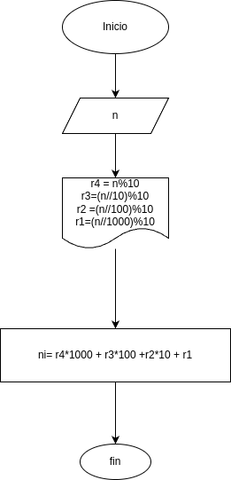

# invertir_numero_de_cuatro_cifras
programa en python para inveritr un numero entero de cuatro digitos

## Analisis

### variables de entrada
- n: número de 4 cifras

### Procesamiento
- r4: el ultimo digito
- r3: el tercer digito
- r2: el segundo digito
- r1: el primer digito 
- ni: el numero invrtido

r4 = n//%10

r3 = (n//10)%10

r2 = (n//100)%10

r1 = (n//1000)%10

ni = r4*1000 + r3*100 + r2*10 + r1

## Diseño

## Construccion
- codigo implementado en el archivo inverse_number.py